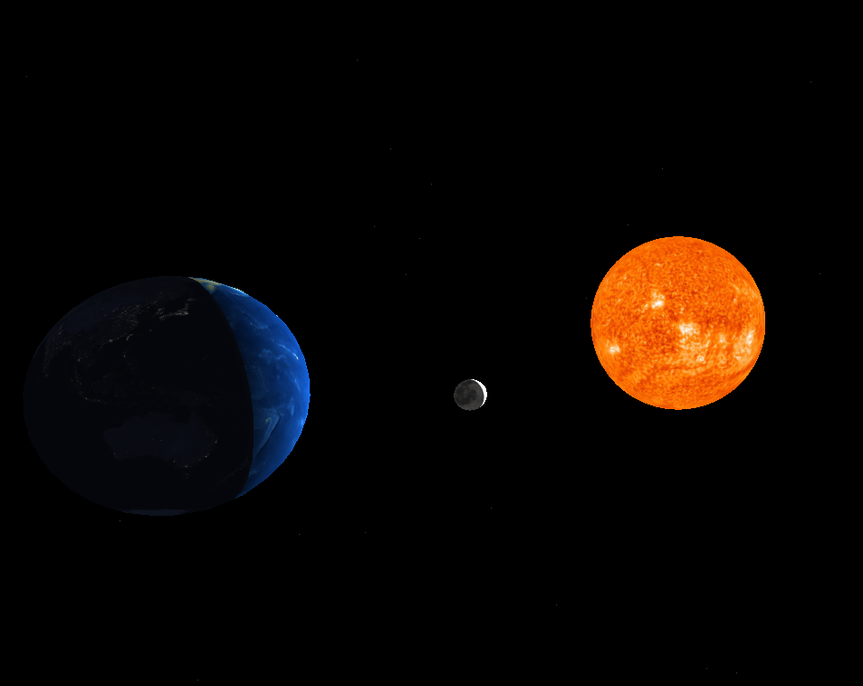

# Solar System Simulation

This project is a real-time solar system simulation using OpenGL and GLFW. It includes models for the sun, earth, and moon, along with textures 
and shaders to create a visually appealing representation.

## Features

- Real-time rendering of celestial bodies.
- Day-night cycle on Earth based on the position of the sun.
- Interactive controls for camera movement and pausing the simulation.
- Starfield background for added realism.

## Structure 
- Dependecies/ : all libraries needed for project
- PlanetSystem/ : project directory
    - src/ : all modules(.cpp, .c, .h) are here.
    - res/ : 
        - planetModels/ : models implementation
        -  shaders/ : shaders for planets

## Run
- you can run it as a visual-studio workspace 
    
## Overview

The planet_system.cpp file serves as the entry point for the Solar System Simulation project. It orchestrates the setup, rendering, and control flow of the application.
Key functionalities include handling user input, initializing OpenGL and GLFW, managing the camera, and rendering celestial bodies.

## Key Features:

### User Input Handling:
The program uses GLFW callbacks to handle keyboard and mouse input.
Moving Keys to control camera movement, allowing users to navigate the 3D space.: 
- W : move forward
- S : move backwards
- UP : move up
- DOWN : move down
- LEFT : move left
- RIGHT : move right
- P : pause/play
- Esc: close window

Mouse movement adjusts the orientation of the camera for a dynamic view.

### Real-time Rendering:
The simulation renders the sun, earth, and moon in real-time using OpenGL.
Celestial bodies are represented using models and textures, creating the space environment.

### Day-Night Cycle:
The simulation incorporates a dynamic day-night cycle, which enhances realism by mimicking the illumination patterns on Earth based on the position of the sun.

#### Features

1. Sunlight Source:
    - The sun serves as the primary light source in the scene.
    - The sun is constantly illuminated, providing consistent lighting.

2. Earth Illumination:
    - The Earth is illuminated on the side facing the sun.
    - Daytime texture is applied to the illuminated side.
    - Nighttime texture is applied to the side in shadow.
    

3. Moon Illumination:
    - The moon's illumination is dependent on its position relative to the sun.
    - When facing the sun, the moon is illuminated.

#### Lighting Effects

The simulation showcases dynamic lighting effects to simulate the transition from day to night and vice versa.

#### Implementation Details

The lighting effects are achieved through coordination of shaders and texture mapping.
Shader logic determines the appearance of the Earth and Moon based on their orientation relative to the sun.

#### Starfield Background:

A starfield background is rendered in the simulation. Stars are represented as points and contribute to the space environment.

### Control Flow:

- Initialization:
GLFW and OpenGL are initialized to set up the rendering context.
Models, shaders, and textures are loaded.

- Main Loop:
The main loop manages per-frame time logic, user input, and rendering.
The camera's view and projection transformations are updated each frame.

- Rendering:
Celestial bodies (sun, earth, and moon) are rendered with appropriate transformations.
Lighting calculations are applied based on the position of the light source (sun).

- Interactive Pausing:
The program checks for the spacebar input to pause or resume the rotation of celestial bodies.
Pausing allows users to observe specific scenarios or configurations.

- Star Rendering:
The starShader is activated, and star positions are updated.
Stars are rendered as points, contributing to the celestial background.

- Swap Buffers and Poll Events:
GLFW swap buffers and poll events are performed to display the rendered frame and handle user input.

### Shaders

#### Overview:

The project utilizes two set of shaders: vertexShader.glsl and fragmentShader.glsl for planets and vertexShaderSource, fragmentShaderSource (implemented in planet_system.cpp) 
for the stars. These shaders are essential for rendering and lighting in the Solar System.

#### Simulation.
1. Vertex Shader (vertexShader.glsl):

    - Input:
    The vertex shader takes vertex positions, normals, and texture coordinates as inputs.

    - Transformations:
    The model, view, and projection matrices are applied to transform vertices into clip space.
    The resulting gl_Position is calculated as projection * view * model * vec4(aPos, 1.0).

2. Fragment Shader (fragmentShader.glsl):

    - Input:
        Receives interpolated values such as FragPos, Normal, and TexCoords from the vertex shader.

    - Lighting Calculation:
        Calculates lighting based on the direction of light and the surface normal.
        Supports both sunlight (for the sun) and indirect lighting (for earth and moon).

    - Texture Mapping:
        Samples the texture based on texture coordinates (TexCoords).
        Day-night cycle is controlled by sampling either the textureSampler or darktextureSampler based on lighting conditions.

    - Resulting Color:
        Combines lighting and texture color to produce the final fragment color (FragColor).

    - Day/Night flag:
        planet:
            Uniform flag distinguishing planets and their lightning. 

        textureSampler, darktextureSampler:
            Uniforms for texture samplers, used for day-night cycle control.

## References

1. OpenGL:
    [OpenGL](https://www.opengl.org/) - Official documentation for OpenGL.

2. GLFW:
    [GLFW Documentation](https://www.glfw.org/documentation.html) - GLFW documentation for window and input handling.

3. Learn OpenGL:
    [Learn OpenGL](https://learnopengl.com/) - Online resource providing tutorials and information about OpenGL.

4. Assimp - Open Asset Import Library:
    [Assimp](https://www.assimp.org/) - Documentation for the Assimp library used for 3D model loading.

5. C++ Standard Library Documentation:
    [C++ Standard Library](https://en.cppreference.com/w/) - Reference for the C++ Standard Library.

6. Υλικό από το εργαστήριο του μαθήματος.

7. GLEW:
    [GLEW](https://glew.sourceforge.net/) - Extension Wrangler Library.

8. GLUT:
    [GLUT](https://freeglut.sourceforge.net/) - freeglut utility.
